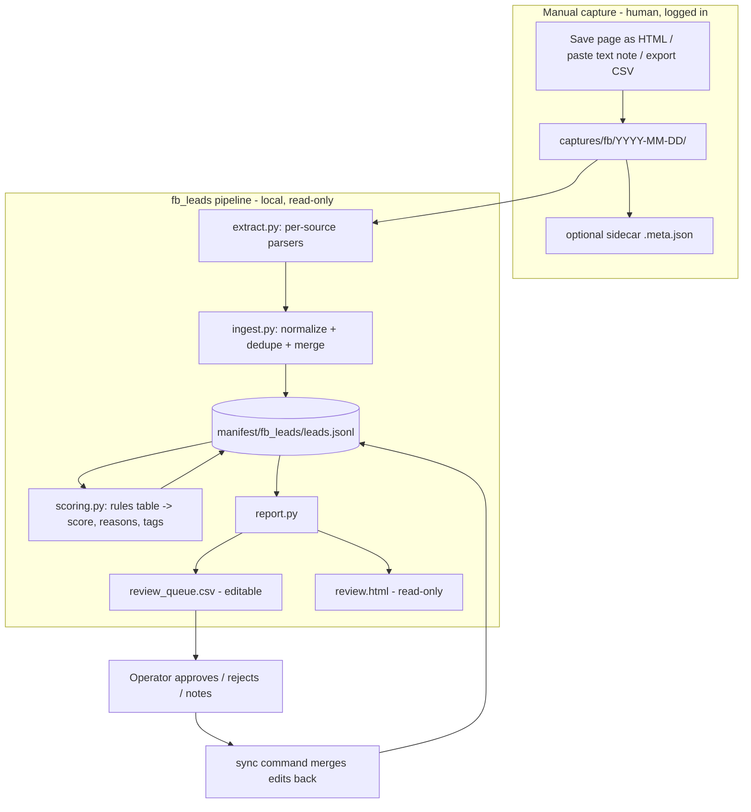

# feat: Facebook Lead Capture + Triage Harness (read-only v1)

## Summary

Add a standalone `fb_leads` package that ingests **manually saved** Facebook captures (HTML pages, text notes, CSV exports), normalizes them into a `LeadCandidate` JSONL store, scores them with deterministic explainable rules, and emits an operator review queue (CSV + static HTML). v1 never touches live Facebook: no network calls, no credentials, no outreach. The whole pipeline runs from saved fixtures and local files.

---

## Problem Frame

The repo already has an outbound lead-qualification engine (`src/agent_core`) and the synthesized playbook in `FB_Lead_Qualification_Architecture.md`, but no way to turn raw Facebook Marketplace/group/page material into a triaged lead list. Manual review of saved posts doesn't scale past a handful. The missing piece is a small, auditable, local harness: capture → normalize → score → review queue, with a human deciding everything that touches the outside world.

**Explicitly not the problem:** messaging automation, live scraping, account/session management, or anti-detection of any kind.

---

## Requirements

**Acquisition (v1 = manual capture only)**

- R1. Ingest operator-saved capture files from a local folder: full-page HTML saves, plain-text/markdown notes, and generic CSV exports.
- R2. Each capture may carry an optional sidecar `<name>.meta.json` (source URL, source type, capture timestamp, manual field overrides); sidecar values win over parsed values.
- R3. Raw captures are never modified or deleted by the pipeline; every normalized lead records a repo-relative `capture_path` back to its raw source.
- R4. A `--live` capture mode exists only as a gated stub that exits with a clear "not implemented in v1" error (same fail-loudly precedent as `skool_ingest` crawl).

**Normalization**

- R5. All sources normalize into one `LeadCandidate` record with a stable content-derived `id`.
- R6. Dedupe on `id`; source URLs are normalized before hashing (strip `fbclid`, `ref`, and other tracking query params).
- R7. Re-ingesting a capture refreshes extracted fields but preserves operator fields (`review_status`, `review_notes`) and existing scores.
- R8. Extraction is best-effort with a recorded status (`ok | partial | failed`); a file that fails to parse produces a `failed` record, never a crash.

**Scoring / triage**

- R9. Scoring is deterministic (pure function of the record + rules table), no LLM and no paid APIs in v1.
- R10. Every score carries human-readable reasons (which rule fired, its weight, its tag) and category tags (e.g. `room_supply`, `owner`, `distressed`, `partnership`, `coliving`, `demand`, `caution`).
- R11. Scores map to triage bands (`hot | warm | low`) via named threshold constants.
- R12. Re-running scoring after a rules change updates scores/reasons without touching review fields.

**Operator review queue**

- R13. Emit a review CSV (one row per lead, sorted by score desc) with editable `review_status` and `review_notes` columns.
- R14. Emit a static HTML report for human scanning: score, band, tags, title, price, location, posted date, seller display name, reasons, and a link to the raw capture.
- R15. A `sync` command merges operator edits from the review CSV back into the JSONL store.
- R16. No command sends, posts, or changes anything anywhere — the queue is the terminal output of v1.

**Safety / compliance**

- R17. Only data the logged-in operator was authorized to view and chose to save manually enters the system; no automated fetching from Facebook in v1.
- R18. No credential storage, no cookies handling, no proxy rotation, no CAPTCHA solving, no rate-limit evasion — these are absent by design, not just disabled.
- R19. All FB lead data (raw captures and derived outputs) stays local and gitignored, since records contain personal display names.
- R20. Runs log what was read and what was produced (file counts, lead counts, output paths).

**Harness / testing**

- R21. Fixture-based tests cover extraction, normalization/dedupe, scoring, report generation, and CSV sync — no network anywhere in the test suite.
- R22. A documented dry-run recipe executes the full pipeline against the committed fixtures into a scratch directory.

---

## Key Technical Decisions

- **Standalone top-level package `fb_leads/`, peer of `skool_ingest/`:** confirmed with operator; keeps v1 decoupled from the `src/agent_core` engine. The only shared surface is stylistic (dataclass models, argparse `python -m` CLI). Wiring scores into agent-core is future work.
- **Flat files, no SQLite:** JSONL for `LeadCandidate` records, CSV for the review queue, static HTML for scanning. Confirmed with operator. Flat files hold comfortably at expected volume (hundreds of leads); the merge rules in R7/R15 remove the main reason a DB would be needed. Revisit only if concurrent editing or >10k records shows up.
- **Meta-first HTML extraction with text fallback:** saved Facebook HTML uses obfuscated, unstable class names. Extractors read `og:*` / `<title>` / JSON-LD first, fall back to visible-text heuristics (`soup.get_text`), and record `extraction: partial` when structure isn't recognized. Sidecar overrides (R2) are the escape hatch when parsing falls short — this keeps v1 useful even on ugly captures.
- **Weighted additive rules, not binary gates:** the playbook's qualification is binary-gate, but that applies to *conversations*. For triaging *posts/listings* a weighted keyword/regex table with tags and reasons ranks the queue; binary gating would discard too much at this earlier funnel stage. Negative weights handle demand-side and scam-signal posts.
- **Review CSV is the editing surface; JSONL is the source of truth:** operators edit `review_status`/`review_notes` in a spreadsheet (same triage ergonomics as `manifest/skool_videos.csv`), then `sync` merges edits back. HTML report is read-only, regenerated on demand.
- **Outputs live under `manifest/fb_leads/` and raw captures under `captures/fb/`:** `captures/` is already gitignored; add `manifest/fb_leads/` to `.gitignore` so no personal data can be committed (R19).
- **Follow `skool_ingest/manifest.py` store idioms:** append-only column/field ordering, `make_id` sha256 prefix, `now_iso`, `load/save/upsert` — proven pattern, zero new dependencies (stdlib + existing `beautifulsoup4`).

---

## High-Level Technical Design



Merge precedence when the same lead `id` is seen again:

```text
sidecar overrides  >  freshly extracted fields  >  stored extracted fields
operator fields (review_status, review_notes) and scores: always preserved on ingest;
scores replaced only by an explicit `score` run.
```

---

## Data Schemas

### LeadCandidate (JSONL, one object per line, `manifest/fb_leads/leads.jsonl`)

Field order is append-only (same discipline as `skool_ingest/manifest.py`):

| Field | Type | Notes |
|---|---|---|
| `id` | str | sha256 16-hex of normalized `source_url` + `"\x00"` + `title`; falls back to `capture_path` + body hash when URL missing |
| `schema_version` | int | starts at 1 |
| `source_url` | str | normalized (tracking params stripped); `""` if unknown |
| `source_type` | str | `marketplace_listing \| group_post \| page_post \| manual_note \| csv_import \| other` |
| `title` | str | |
| `body_text` | str | visible text, whitespace-collapsed |
| `price_text` | str | raw as seen, e.g. `"$650/mo"` |
| `price_value` | float or null | parsed numeric when unambiguous |
| `currency` | str | `"USD"` default when `$` seen, else `""` |
| `location` | str | as visible; no geocoding |
| `posted_at` | str | ISO 8601 or `""` |
| `seller_name` | str | display name as visible only; no profile enrichment |
| `images` | list | metadata only: `[{"src_name": str, "alt": str}]`; no image downloading |
| `capture_time` | str | ISO 8601 (sidecar > file mtime) |
| `capture_path` | str | repo-relative path to raw file (R3 audit trail) |
| `extraction` | str | `ok \| partial \| failed` |
| `score` | int | 0 until scored |
| `score_band` | str | `hot \| warm \| low \| unscored` |
| `score_reasons` | list[str] | e.g. `"matched 'rent by the room' (+4, coliving)"` |
| `tags` | list[str] | rule categories that fired |
| `review_status` | str | `pending \| approved \| rejected` |
| `review_notes` | str | operator free text |
| `updated_at` | str | ISO 8601 |

### Sidecar meta (`<capture>.meta.json`, optional, human-written)

```json
{
  "source_url": "https://www.facebook.com/marketplace/item/123...",
  "source_type": "marketplace_listing",
  "captured_at": "2026-07-02T18:30:00Z",
  "note": "saved during evening browse, looks like tired landlord",
  "overrides": {"location": "Houston, TX", "price_text": "$650/mo"}
}
```

### Review queue CSV (`manifest/fb_leads/review_queue.csv`)

Columns: `id, score, score_band, tags, title, price_text, location, posted_at, seller_name, source_type, source_url, capture_path, score_reasons, review_status, review_notes`. Sorted score desc. Only `review_status` and `review_notes` are read back by `sync`; all other columns are display-only.

### Scoring rules (module-level table in `fb_leads/scoring.py`)

Each rule: `(pattern, weight, tag, reason_label)`. Categories (exact patterns are implementation detail; representative examples):

- `room_supply` (+): "room for rent", "private room", "furnished", "month to month", "utilities included"
- `owner` (+): "landlord", "I own", "my property", "my tenant"
- `distressed` (+): "vacant", "must rent asap", "tired of managing", "motivated"
- `partnership` (+): "rental arbitrage", "corporate lease", "sublease allowed", "property manager wanted"
- `coliving` (+): "coliving", "co-living", "rent by the room", "shared housing"
- `demand` (−): "looking for a room", "need a place" (tenant-side post, not supply)
- `caution` (−): "deposit before viewing", "cashapp only" (scam markers)

Bands: `HOT_THRESHOLD = 8`, `WARM_THRESHOLD = 4` (named constants, tuned later against real captures).

---

## CLI Design

All subcommands via `python -m fb_leads` (argparse, mirrors `skool_ingest/__main__.py`):

```bash
# Ingest saved captures → JSONL store (idempotent, merge-preserving)
python -m fb_leads ingest --captures captures/fb --leads manifest/fb_leads/leads.jsonl

# Score / rescore all leads (deterministic; preserves review fields)
python -m fb_leads score --leads manifest/fb_leads/leads.jsonl

# Emit review CSV + static HTML report
python -m fb_leads report --leads manifest/fb_leads/leads.jsonl --out-dir manifest/fb_leads

# Merge operator CSV edits back into JSONL
python -m fb_leads sync --csv manifest/fb_leads/review_queue.csv --leads manifest/fb_leads/leads.jsonl

# Whole pipeline in one shot (ingest + score + report)
python -m fb_leads run --captures captures/fb --out-dir manifest/fb_leads

# Counts by band / status / source_type
python -m fb_leads status --leads manifest/fb_leads/leads.jsonl

# Dry run: full pipeline against committed fixtures into a scratch dir
python -m fb_leads run --captures tests/fixtures/fb_leads/captures --out-dir /tmp/fb_leads_dryrun

# Live mode: gated stub, exits 2 with explanation (v1)
python -m fb_leads ingest --live ...   # -> "live capture not implemented in v1; save pages manually"
```

Each command prints a JSON summary of counts (files read, leads written/updated, outputs) — same convention as `fanout`'s `json.dumps(counts)` — and logs via `logging.basicConfig`.

---

## Output Structure

```text
fb_leads/
  __init__.py
  __main__.py        # argparse CLI: ingest, score, report, sync, run, status
  models.py          # LeadCandidate dataclass, id/URL normalization, JSONL load/save/merge
  extract.py         # per-source parsers (marketplace HTML, group/page HTML, text note, CSV)
  ingest.py          # capture-dir walk, sidecar handling, normalize + dedupe + merge
  scoring.py         # rules table, score_lead(), band constants
  report.py          # review CSV writer, HTML report, CSV sync-back
tests/
  fixtures/fb_leads/captures/
    marketplace_room.html            (+ marketplace_room.meta.json)
    marketplace_furniture_bed.html   # room posted in furniture category
    group_post_landlord.html
    group_post_demand.html
    notes/tired_landlord_note.txt    (+ .meta.json)
    export_sample.csv
    malformed.html
  test_fb_leads_models.py
  test_fb_leads_extract.py
  test_fb_leads_ingest.py
  test_fb_leads_scoring.py
  test_fb_leads_report.py
```

Modified files: `pyproject.toml` (add `fb_leads*` to `[tool.setuptools.packages.find] include`), `.gitignore` (add `manifest/fb_leads/`), `README.md` (usage section incl. dry-run recipe and compliance notes).

---

## Implementation Units

### U1. Package scaffold + LeadCandidate model + JSONL store

- **Goal:** `fb_leads` package exists with the data model and a merge-preserving JSONL store.
- **Requirements:** R5, R6, R7
- **Dependencies:** none
- **Files:** `fb_leads/__init__.py`, `fb_leads/models.py`, `tests/test_fb_leads_models.py`, `pyproject.toml`, `.gitignore`
- **Approach:** Mirror `skool_ingest/manifest.py`: dataclass with `__post_init__` id computation, append-only field tuple, `make_id`/`now_iso` helpers, `load`/`save` over JSONL keyed by id, plus `merge(existing, incoming)` implementing the precedence rules (extracted fields refresh; `review_status`, `review_notes`, `score*` preserved). URL normalization strips `fbclid`, `ref`, `tracking` and friends before hashing.
- **Patterns to follow:** `skool_ingest/manifest.py` (store idioms), `src/agent_core/agents.py` (dataclass style), ruff line-length 100 / py311.
- **Test scenarios:**
  - Same `source_url`+`title` → same id across runs; differing tracking params (`?fbclid=...`) → same id.
  - Missing `source_url` → id derived from `capture_path` + body hash, stable across runs.
  - JSONL round-trip preserves all fields including lists (`tags`, `images`, `score_reasons`).
  - Merge: incoming record with fresh `body_text` + stored record with `review_status=approved, notes="call back"` → merged record has new body and preserved review fields.
  - Loading a store containing an unknown extra field (forward compat) does not crash.
  - Empty/missing JSONL file loads as empty dict.
- **Verification:** model tests pass; `python -c "import fb_leads"` works from repo root.

### U2. Fixtures + extractors

- **Goal:** Saved-capture fixtures exist and per-source extractors turn them into raw field dicts.
- **Requirements:** R1, R2, R8
- **Dependencies:** U1
- **Files:** `fb_leads/extract.py`, `tests/fixtures/fb_leads/captures/*` (7 fixtures per Output Structure), `tests/test_fb_leads_extract.py`
- **Approach:** One `extract_capture(path, meta) -> RawExtract` dispatcher by file type; HTML path reads `og:title`/`og:description`/`og:url`/`<title>`/JSON-LD first, falls back to `get_text()` heuristics for body/price/location; text notes become `manual_note` records (first line = title); CSV importer maps a documented minimal column set. Any parse exception → `extraction: failed` record carrying `capture_path` and the error string in `body_text`. Fixtures are simplified structural mimics of real saves (same technique as `tests/test_crawl_parsing.py` canned HTML), one intentionally malformed.
- **Patterns to follow:** `skool_ingest/skool_crawl.py` `_extract_*` helper style + `tests/test_crawl_parsing.py` fixture approach; `beautifulsoup4` already a dependency.
- **Test scenarios:**
  - Marketplace HTML with og-tags → title, price_text `"$650/mo"` → price_value 650.0, location, seller name extracted; `extraction: ok`.
  - Furniture-category room listing (no rental og markup) → best-effort text extraction, `extraction: partial`.
  - Group post HTML → poster display name and body text extracted.
  - Text note with sidecar → sidecar `source_url`/`source_type`/`overrides` applied over parsed values.
  - CSV import with 2 rows → 2 raw extracts with `source_type: csv_import`.
  - `malformed.html` → returns a `failed` record, no exception.
  - Non-capture files (`.meta.json`, `.DS_Store`) skipped by the dispatcher.
  - Price edge cases: `"650"`, `"$650-$700"` (range → null value, raw text kept), `"free"` → null.
- **Verification:** extractor tests pass against fixtures only, zero network.

### U3. Ingest pipeline + `ingest` / `status` CLI

- **Goal:** `python -m fb_leads ingest` walks a captures dir and produces/updates the JSONL store idempotently.
- **Requirements:** R1, R3, R4, R6, R7, R20
- **Dependencies:** U1, U2
- **Files:** `fb_leads/ingest.py`, `fb_leads/__main__.py`, `tests/test_fb_leads_ingest.py`
- **Approach:** Recursive walk of `--captures`, pair files with sidecars, extract → normalize → merge into store. Raw files opened read-only, never moved (R3). CLI skeleton mirrors `skool_ingest/__main__.py` (subparsers, `cmd_*` functions returning exit codes, JSON count summary, logging). `--live` flag prints the R4 refusal and exits 2. `status` prints Counter breakdowns by `score_band`/`review_status`/`source_type`/`extraction` (mirrors `cmd_status`).
- **Test scenarios:**
  - Ingest fixtures dir into `tmp_path` store → expected lead count, each record has repo-relative `capture_path` and `capture_time`.
  - Second ingest of same dir → same count, no duplicates, `review_status` edits made between runs preserved.
  - Empty captures dir → exit 0, zero-lead summary, no store corruption.
  - `--live` → exit code 2, refusal message on stderr, store untouched.
  - Summary JSON reports files_read / leads_new / leads_updated / failed counts (R20).
- **Verification:** `python -m fb_leads ingest --captures tests/fixtures/fb_leads/captures --leads /tmp/x.jsonl` succeeds end-to-end; ingest tests pass.

### U4. Deterministic scoring engine + `score` CLI

- **Goal:** Rules table scores every lead with reasons, tags, and bands.
- **Requirements:** R9, R10, R11, R12
- **Dependencies:** U1, U3
- **Files:** `fb_leads/scoring.py`, `fb_leads/__main__.py` (add subcommand), `tests/test_fb_leads_scoring.py`
- **Approach:** Module-level `RULES` tuple of `(compiled_regex, weight, tag, label)` per the schema section; `score_lead(lead) -> (score, band, reasons, tags)` is a pure function over `title + body_text` (case-insensitive). Named `HOT_THRESHOLD`/`WARM_THRESHOLD` constants. `score` subcommand loads store, scores all (or `--only-unscored`), writes back preserving review fields.
- **Patterns to follow:** `src/agent_core/agents.py` — deterministic, no I/O in the scoring function, constants at module top.
- **Test scenarios:**
  - Body with "rent by the room" + "landlord" → both rules fire, score = sum of weights, reasons list names each match with weight and tag.
  - "looking for a room" demand post → negative weight applied, `demand` tag present, band `low`.
  - "deposit before viewing" → `caution` tag, negative weight.
  - Score exactly at `WARM_THRESHOLD` → band `warm` (boundary inclusive).
  - Same lead scored twice → identical output (determinism).
  - Rescoring a lead with `review_status=approved` leaves review fields untouched (R12).
  - Lead with empty body (`extraction: failed`) → score 0, band `low`, no crash.
- **Verification:** scoring tests pass; `status` shows band distribution after `score` run on fixtures.

### U5. Review queue CSV + HTML report + `report` / `sync` CLI

- **Goal:** Operator-facing outputs: editable CSV queue, read-only HTML report, and CSV→JSONL sync-back.
- **Requirements:** R13, R14, R15, R16
- **Dependencies:** U1, U4
- **Files:** `fb_leads/report.py`, `fb_leads/__main__.py` (add subcommands), `tests/test_fb_leads_report.py`
- **Approach:** CSV via `csv.DictWriter` with the column contract from Data Schemas, sorted score desc. HTML via an f-string template in the style of `scripts/build_video_index.py` (system-ui table, no JS, no external assets); capture links are relative paths so the report works offline. `sync` reads only `id`, `review_status`, `review_notes` from the CSV, validates status values, merges into JSONL. All escaping via `html.escape` (lead text is untrusted).
- **Test scenarios:**
  - Report over 3 scored leads → CSV has exact column set, rows sorted by score desc.
  - HTML contains each lead's title (escaped), band, and a link to its `capture_path`.
  - Lead body containing `<script>` → escaped in HTML output (no injection).
  - Sync: edit CSV row to `approved` + note → JSONL updated for that id only; other records untouched.
  - Sync with invalid status value `"maybe"` → row rejected with warning, exit code non-zero, store unchanged for that row.
  - Sync with unknown id → warning, skipped, no crash.
- **Verification:** open generated `review.html` locally and confirm it renders; report tests pass.

### U6. End-to-end `run` command, dry-run recipe, docs, compliance notes

- **Goal:** One-shot pipeline command; documented dry-run; README section covering usage and guardrails.
- **Requirements:** R17, R18, R19, R20, R21, R22
- **Dependencies:** U3, U4, U5
- **Files:** `fb_leads/__main__.py` (add `run`), `README.md`, `tests/test_fb_leads_ingest.py` (extend with pipeline test)
- **Approach:** `run` chains ingest → score → report into `--out-dir`, prints combined summary. README gains an "FB lead triage" section: manual capture procedure (logged-in human uses browser Save Page As / copy-paste; no automated fetching), the dry-run command against fixtures, compliance stance (read-only, no outreach, no evasion, ToS note that automated FB collection is out of scope by design, data stays local/gitignored), and the future roadmap (browser-assisted capture behind human approval, optional LLM scoring, agent-core integration).
- **Test scenarios:**
  - Full pipeline over fixtures into `tmp_path` → `leads.jsonl`, `review_queue.csv`, `review.html` all exist with consistent lead counts across the three artifacts.
  - Pipeline run twice → identical artifact contents modulo timestamps (idempotence).
  - Test expectation for README changes: none — documentation only.
- **Verification:** dry-run recipe from README works verbatim; full suite green.

---

## Test Strategy

- Runner: existing repo convention — `pytest` from repo root, `sys.path.insert` header per test module (see `tests/test_agent_core.py`).
- Exact commands:

```bash
.venv/bin/pytest tests/test_fb_leads_models.py tests/test_fb_leads_extract.py -q   # per-unit during work
.venv/bin/pytest tests/ -k fb_leads -q                                             # whole feature
.venv/bin/pytest tests/ -q                                                         # full suite before commit
.venv/bin/ruff check fb_leads tests                                                # lint
```

- No test touches the network; fixtures are committed simplified mimics (safe: no real personal data in fixtures — invent names).
- Real-capture validation is manual: operator saves 2-3 genuine pages into `captures/fb/` and runs the pipeline; expect `partial` extraction on some, fixed via sidecars.

---

## Acceptance Criteria

1. `python -m fb_leads run --captures tests/fixtures/fb_leads/captures --out-dir /tmp/fb_leads_dryrun` completes with exit 0 and produces `leads.jsonl`, `review_queue.csv`, `review.html`.
2. Every lead in the CSV/HTML traces back to a raw capture file via `capture_path`, and every score shows at least the reasons that produced it.
3. Re-running ingest and score never loses operator `review_status`/`review_notes`.
4. `--live` refuses with a clear message; grep of `fb_leads/` finds no `requests`/`httpx`/network imports.
5. `manifest/fb_leads/` and `captures/` are gitignored; `git status` stays clean after a pipeline run on real captures.
6. Full test suite (existing + new) passes; ruff clean.

---

## Scope Boundaries

**In scope (v1):** everything above.

**Deferred to follow-up work:**

- Browser-assisted capture (human-driven, e.g. Notte or Claude-in-Chrome saving pages the operator navigates to, with per-page approval and conservative delays) — gated phase 2.
- Optional LLM scoring pass layered on top of deterministic rules (local model or cheap API, still explainable).
- Graph API path if an authorized page/asset makes official data available.
- Wiring approved leads into `src/agent_core` qualification gates and any outreach workflow (always human-approved per lead).
- SQLite store — only if flat files demonstrably fail (concurrent edits or ~10k+ records).

**Outside this product's identity:** mass DM automation, anti-detection, proxy rotation, CAPTCHA solving, credential storage, scraping data the operator can't legitimately see, and anything that posts or messages on Facebook.

---

## Risks & Dependencies

- **Real saved FB HTML is obfuscated and varies by save method.** Highest risk. Mitigated by meta-first extraction, `partial` status honesty, sidecar overrides, and manual validation on genuine captures before trusting the queue. Fixtures will drift from reality — treat sidecars as the pressure valve, not a failure.
- **Rule tuning needs real data.** Initial weights/thresholds are guesses; plan a tuning pass after the first ~50 real captures. Reasons strings make bad scores diagnosable.
- **Privacy of local data.** Records contain visible personal names. Gitignore covers the repo; operator should keep `captures/` out of cloud-synced folders.
- **ToS posture.** v1 operates only on files a human saved from their own authorized session, which is the conservative position; the deferred browser-assisted phase must re-evaluate ToS exposure before build.
- **No new dependencies** — stdlib + existing `beautifulsoup4`; nothing to pin.

---

## Sources & Research

- `FB_Lead_Qualification_Architecture.md` — funnel shape, binary-gate qualification (conversation stage), FB Marketplace as primary channel, compliance habits.
- `skool_ingest/manifest.py` — store pattern (append-only columns, id hashing, load/save/upsert).
- `skool_ingest/__main__.py` — CLI shape, fail-loudly gating precedent for unimplemented backends.
- `src/agent_core/agents.py` — deterministic, explainable gate style.
- `tests/test_crawl_parsing.py` — canned-HTML fixture testing approach.
- `scripts/build_video_index.py` — static HTML report style.
