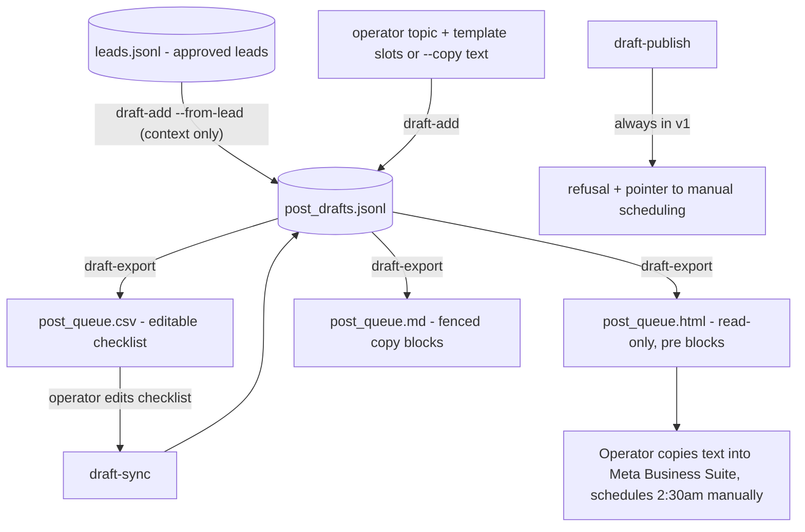
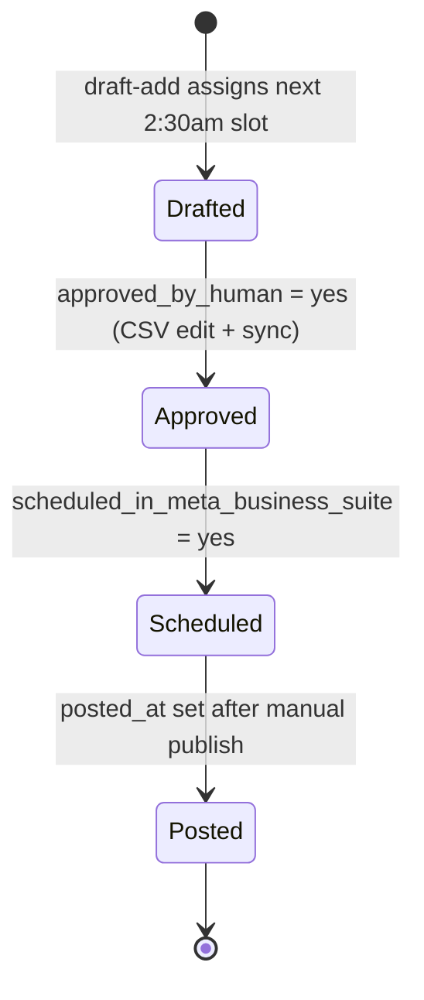

# feat: 2:30am Facebook Posting Draft Queue (drafts-only v1)

## Summary

Extend `fb_leads` with a posting draft queue: the operator turns approved leads or standalone topics into draft post records with copy-paste-ready text and a `scheduled_for` defaulting to the next free 2:30am local slot, then exports the queue as JSONL/CSV/HTML/Markdown with a human checklist (`approved_by_human`, `scheduled_in_meta_business_suite`, `posted_at`, `notes`). Nothing is ever posted by the system — the operator schedules manually in Meta Business Suite. A future official-API adapter exists only as a refusal stub, disabled by default.

---

## Problem Frame

The triage harness ends at an approved-leads queue; the playbook's next step is posting room listings on a consistent 2:30am cadence. Doing that by hand means re-writing copy nightly and losing track of what was approved, scheduled, and actually posted. The gap is a local drafting + scheduling ledger, not a posting robot: draft copy once, assign slots, track the manual Meta Business Suite steps.

**Explicitly not the problem:** submitting posts, browser automation against Facebook, replying to leads (outreach stays banned), or account management of any kind.

---

## Requirements

**Selection & drafting**

- R1. Operator creates a draft from a standalone topic or from an approved lead in `manifest/fb_leads/leads.jsonl`; lead linkage is reference-only context (never a reply target), recorded as `lead_ids`.
- R2. Creating a draft from a lead whose `review_status` is not `approved` fails unless explicitly overridden.
- R3. Draft copy comes from deterministic slot-fill templates (no LLM, no paid APIs) or from operator-supplied text (`--copy` / `--copy-file`); template rendering fails loudly on missing slots.
- R4. Every draft stores final `copy_text` verbatim — what the operator will paste is exactly what the store holds.

**Scheduling**

- R5. `scheduled_for` defaults to the next 2:30am local time not already taken by another draft (one draft per night); explicit `--at` overrides, and multiple drafts auto-space across successive nights.
- R6. Times are timezone-aware (stdlib `zoneinfo`), default system-local, `--tz` accepts an IANA name; stored as ISO 8601 with offset plus the zone name.

**Exports & checklist**

- R7. The draft store is JSONL (`manifest/fb_leads/post_drafts.jsonl`) following the harness store discipline (append-only field tuple, stable id, merge-preserving upsert).
- R8. Exports: editable CSV queue, read-only HTML page, and Markdown file — all sorted by `scheduled_for`, all showing copy-paste-ready text (HTML in `<pre>`, Markdown in fenced blocks).
- R9. Checklist fields per draft: `approved_by_human`, `scheduled_in_meta_business_suite` (both `yes|no`, default `no`), `posted_at` (ISO or empty), `notes`; a sync command merges CSV edits of exactly these fields back into JSONL.
- R10. Checklist fields survive every re-export, re-render, or store rewrite (same preservation discipline as lead `review_*` fields).
- R11. A status command summarizes the queue: counts by approved/scheduled/posted and the upcoming slot list.

**Safety / compliance**

- R12. No command posts, submits, or connects to Facebook; grep of the new modules finds no network imports.
- R13. `draft-publish` exists only as a gated refusal stub: exits non-zero with a message directing the operator to schedule manually in Meta Business Suite; the future official-API path stays disabled by default (env gate + explicit flag) and unimplemented in v1.
- R14. No fake accounts, no browser posting automation, no bypass of platform protections, no mass posting — one-per-night default pacing is the anti-spam posture.
- R15. Draft data stays local and gitignored (lives under already-ignored `manifest/fb_leads/`).
- R16. Template copy is static and human-reviewable so fair-housing/ToS review happens once per template, not per post.

---

## Key Technical Decisions

- **Drafts live inside `fb_leads`, not a new package:** the queue consumes the leads store and mirrors its idioms; a separate package would duplicate the store/CLI/report machinery for no isolation benefit.
- **Two copy paths, templates first:** deterministic `{slot}` templates keep the no-LLM stance and make compliance review a one-time act per template (R16); `--copy`/`--copy-file` covers hand-written posts so the queue never blocks on template fit. Confirmed with operator.
- **Lead links are context-only:** since outreach is out of scope, `lead_ids` exist to trace which market intel inspired a listing draft — nothing reads them to address anyone. Confirmed with operator.
- **One draft per night auto-spacing:** matches the "2:30am cadence" requirement and doubles as anti-spam pacing; `--at` is the pressure valve for exceptions. Confirmed with operator.
- **Checklist fields are `yes|no` strings, not booleans:** the CSV is the editing surface (spreadsheet ergonomics, same as lead review columns); validation happens at sync, mirroring `report.sync_review_csv`.
- **Publish stub mirrors `ingest.refuse_live_capture`:** proven fail-loudly precedent already in the package; the stub refuses even when the future env gate (`FB_LEADS_ENABLE_META_API=1` plus an explicit CLI flag) is set, because v1 ships no adapter behind it.
- **Markdown export added to the format set:** vault-friendly (Obsidian workflow) and the most natural copy-paste surface for post text; costs one small writer function.

---

## High-Level Technical Design



Draft lifecycle (tracked entirely by checklist fields, advanced only by the human):



---

## Data Schema

### PostDraft (JSONL, `manifest/fb_leads/post_drafts.jsonl`)

Append-only field tuple, same discipline as `fb_leads/models.py` `FIELDS`:

| Field | Type | Notes |
|---|---|---|
| `id` | str | 16-hex hash of `topic` + `created_at` (stable across copy edits) |
| `schema_version` | int | starts at 1 |
| `topic` | str | short operator label, e.g. `room-303-houston` |
| `lead_ids` | list[str] | reference-only links into `leads.jsonl`; may be empty |
| `template_id` | str | `""` when copy is operator-written |
| `title` | str | internal label / post headline |
| `copy_text` | str | final paste-ready post body, stored verbatim (R4) |
| `price_text` | str | slot value as shown in copy |
| `location` | str | slot value |
| `images_note` | str | reminder of which photos to attach; no image files handled |
| `target_surface` | str | `marketplace \| group \| page \| other` — where the operator will post |
| `scheduled_for` | str | ISO 8601 with offset, e.g. `2026-07-04T02:30:00-05:00` |
| `timezone` | str | IANA name used to compute the slot |
| `approved_by_human` | str | `yes \| no`, default `no` |
| `scheduled_in_meta_business_suite` | str | `yes \| no`, default `no` |
| `posted_at` | str | ISO 8601 or `""`; filled by operator after manual publish |
| `notes` | str | operator free text |
| `created_at` / `updated_at` | str | ISO 8601 |

Checklist preservation set (mirrors `_SCORE_AND_REVIEW_FIELDS`): `approved_by_human`, `scheduled_in_meta_business_suite`, `posted_at`, `notes`.

### Templates (module table in `fb_leads/post_templates.py`)

`TEMPLATES: dict[template_id -> format string]` with named slots (`{location}`, `{price}`, `{room_desc}`, `{move_in}`, ...). Ship two starters: `room_listing`, `coliving_room`. Template text is plain, static, and written fair-housing-clean (no occupancy/tenant-restriction language in copy — per the playbook, screening constraints belong to the conversation stage, never the ad).

### Queue CSV (`manifest/fb_leads/post_queue.csv`)

Columns: `id, scheduled_for, topic, target_surface, title, copy_text, price_text, location, images_note, lead_ids, approved_by_human, scheduled_in_meta_business_suite, posted_at, notes`. Sorted by `scheduled_for` ascending. Sync reads back only `id` + the four checklist fields.

---

## CLI Design

New flat subcommands on the existing `python -m fb_leads` parser (matches shipped `cmd_*` style):

```bash
# Create a draft from a template (auto-slot: next free 2:30am local)
python -m fb_leads draft-add --topic room-303 --template room_listing \
    --price '$650/mo' --location 'Houston, TX' --room-desc 'furnished private room' \
    [--surface marketplace] [--at 2026-07-05T02:30] [--tz America/Chicago]

# Create a draft with operator-written copy, linked to an approved lead as context
python -m fb_leads draft-add --topic room-303 --copy-file drafts/room303.txt \
    --from-lead a1b2c3d4e5f60789 --leads manifest/fb_leads/leads.jsonl

# List / summarize the queue
python -m fb_leads draft-list --drafts manifest/fb_leads/post_drafts.jsonl

# Export queue: post_queue.csv + post_queue.html + post_queue.md
python -m fb_leads draft-export --drafts manifest/fb_leads/post_drafts.jsonl \
    --out-dir manifest/fb_leads

# Merge operator checklist edits from CSV back into JSONL
python -m fb_leads draft-sync --csv manifest/fb_leads/post_queue.csv \
    --drafts manifest/fb_leads/post_drafts.jsonl

# Gated stub — always refuses in v1
python -m fb_leads draft-publish ...
# -> exit 2: "auto-posting is not implemented; schedule manually in Meta Business Suite"
```

Every command prints a JSON summary via the existing `print_json` convention and logs reads/writes (R20 posture carried over from the harness).

---

## Implementation Units

### U1. PostDraft model + JSONL store + 2:30am slot logic

- **Goal:** Draft records exist with the store discipline and slot assignment working.
- **Requirements:** R5, R6, R7, R10
- **Dependencies:** none
- **Files:** `fb_leads/drafts.py`, `tests/test_fb_leads_drafts.py`
- **Approach:** Mirror `fb_leads/models.py`: dataclass + `FIELDS` tuple, `make_id`-style hash, `load/save/upsert` over JSONL, `merge` preserving the checklist set. `next_slot(existing, tz, now)` returns the earliest future 2:30am (`DEFAULT_POST_HOUR/MINUTE` constants) whose calendar date is unclaimed; timezone via `zoneinfo`, default from system local.
- **Patterns to follow:** `fb_leads/models.py` (store, coercion helpers), constants-at-top style from `fb_leads/scoring.py`.
- **Test scenarios:**
  - Store round-trip preserves all fields including `lead_ids` list.
  - Merge: incoming draft with new `copy_text` + stored draft with `approved_by_human=yes, posted_at` set → text refreshed, checklist untouched.
  - `next_slot` at 1:00am local → today 2:30am; at 3:00am → tomorrow 2:30am.
  - Two drafts added same day → slots on consecutive nights (auto-spacing).
  - `--at`-style explicit datetime accepted even when that date already has a draft.
  - Non-existent IANA zone name → clear error, non-zero exit.
  - DST spring-forward date where 2:30am is ambiguous/nonexistent → slot still produced deterministically (document the chosen fold behavior in a test).
- **Verification:** draft model tests pass; store file diff-stable across repeat saves.

### U2. Templates + `draft-add` / `draft-list` CLI

- **Goal:** Operator can create drafts from templates, raw copy, or an approved lead, and inspect the queue.
- **Requirements:** R1, R2, R3, R4, R11
- **Dependencies:** U1
- **Files:** `fb_leads/post_templates.py`, `fb_leads/__main__.py`, `tests/test_fb_leads_drafts.py` (extend)
- **Approach:** `render(template_id, slots) -> str` over the `TEMPLATES` table; missing slot → `KeyError` surfaced as exit-2 CLI error. `draft-add` resolves copy precedence: `--copy`/`--copy-file` > template. `--from-lead` loads `leads.jsonl`, requires `review_status == approved` unless `--allow-unapproved`, prefills `price_text`/`location`/`title` slots from the lead, records `lead_ids`. `draft-list` prints per-draft one-liners plus Counter summaries (checklist states, upcoming slots) in `status_summary` style.
- **Patterns to follow:** `fb_leads/__main__.py` subparser + `cmd_*` + `set_defaults`; `fb_leads/ingest.py` `status_summary`.
- **Test scenarios:**
  - Template render with all slots → copy contains substituted values; stored `copy_text` matches rendered output exactly (R4).
  - Missing slot → loud failure, no draft written.
  - `--copy-file` path → file content stored verbatim, `template_id` empty.
  - `--from-lead` with approved lead → slots prefilled, `lead_ids` recorded.
  - `--from-lead` with pending lead → refused; with `--allow-unapproved` → created with warning.
  - `--from-lead` with unknown id → error, exit non-zero.
  - `draft-list` on empty store → clean zero summary.
- **Verification:** end-to-end `draft-add` → `draft-list` shows the draft with correct slot and copy.

### U3. Queue exports (CSV/HTML/Markdown) + `draft-sync`

- **Goal:** Operator-facing queue artifacts and checklist round-trip.
- **Requirements:** R8, R9, R10, R15
- **Dependencies:** U1, U2
- **Files:** `fb_leads/draft_report.py`, `fb_leads/__main__.py`, `tests/test_fb_leads_draft_report.py`
- **Approach:** Follow `fb_leads/report.py` shape: `generate_queue(drafts_path, out_dir)` writes the three artifacts sorted by `scheduled_for`; `sync_queue_csv` validates `yes|no` on the two flags and ISO-or-empty on `posted_at`, merges only checklist fields, reuses the `sync_exit_code` convention. HTML: no JS, `html.escape` everywhere, copy text in `<pre>`; Markdown: one section per draft with a fenced block holding `copy_text` plus a checklist line.
- **Test scenarios:**
  - Export over 3 drafts → CSV column contract exact, rows ordered by slot; HTML and MD contain each draft's copy text.
  - Copy text containing `<script>` and markdown backticks → escaped in HTML, intact inside MD fence.
  - Sync: CSV edited to `approved_by_human=yes` + note → JSONL updated for that id only.
  - Sync with `approved_by_human=maybe` → row rejected, non-zero exit, store unchanged for that row.
  - Sync with malformed `posted_at` → rejected with warning.
  - Sync with unknown id → skipped with warning, no crash.
  - Re-export after sync → checklist values appear in fresh artifacts (R10 round-trip).
- **Verification:** open `post_queue.html` and `post_queue.md` locally; a paste from either matches `copy_text` byte-for-byte.

### U4. `draft-publish` refusal stub + README + compliance notes

- **Goal:** The no-auto-posting boundary is executable, documented, and tested.
- **Requirements:** R12, R13, R14, R16
- **Dependencies:** U2
- **Files:** `fb_leads/__main__.py`, `fb_leads/drafts.py` (refusal helper), `README.md`, `tests/test_fb_leads_drafts.py` (extend)
- **Approach:** `refuse_publish()` modeled on `ingest.refuse_live_capture`: exit 2, message naming the manual path (Meta Business Suite scheduled posts) and the gate design (future adapter requires `FB_LEADS_ENABLE_META_API=1` + `--i-understand-official-api`, and still raises not-implemented in v1 — the gate is documented, the adapter is absent). README `fb_leads` section gains a "Posting draft queue" subsection: workflow (draft → approve → schedule manually at 2:30am → mark posted), template fair-housing note (R16), and the explicit non-goals (no auto-posting, no fake accounts, no automation against Facebook).
- **Test scenarios:**
  - `draft-publish` → exit 2, refusal message, store untouched.
  - `draft-publish` with `FB_LEADS_ENABLE_META_API=1` and the flag → still refuses in v1 (env gate alone must not open a path).
  - Grep-style assertion (test or acceptance step): no `requests`/`httpx`/`urllib.request` imports in `fb_leads/drafts.py`, `fb_leads/post_templates.py`, `fb_leads/draft_report.py` (R12).
  - Test expectation for README changes: none — documentation only.
- **Verification:** README workflow runnable verbatim; full suite green.

---

## Test Strategy

Same harness conventions — no network anywhere, `pytest` from repo root:

```bash
.venv/bin/pytest tests/test_fb_leads_drafts.py tests/test_fb_leads_draft_report.py -q
.venv/bin/pytest tests/ -k fb_leads -q
.venv/bin/pytest tests/ -q && .venv/bin/ruff check fb_leads tests
```

Timezone-sensitive tests pin an explicit IANA zone and injected `now` — never the machine clock.

---

## Acceptance Criteria

1. `draft-add` (template and `--copy` paths) → `draft-export` produces `post_drafts.jsonl`, `post_queue.csv`, `post_queue.html`, `post_queue.md`, with two same-day drafts landing on consecutive 2:30am slots.
2. Editing checklist fields in the CSV and running `draft-sync` updates JSONL; a subsequent `draft-export` shows the edits; no other fields change.
3. Copy pasted from the HTML or Markdown export matches the stored `copy_text` exactly.
4. `draft-publish` refuses with exit 2 in every configuration, including with the env gate set.
5. No network imports in the new modules; `git status` clean after a real queue run (outputs land in gitignored `manifest/fb_leads/`).
6. Full test suite + ruff pass.

---

## Scope Boundaries

**Deferred to follow-up work:**

- Official Meta Graph/Pages API adapter behind the documented gate — build only after verifying eligibility (business asset, app review, published-page requirements) against current Meta docs; verification itself is deferred, not assumed.
- Draft copy variation helpers (rotating openers, per-surface variants) — only if repeat posting shows copy fatigue.
- Wiring `posted_at` outcomes back into lead/market analytics.

**Outside this product's identity:** auto-posting, browser automation against Facebook, fake or secondary accounts, mass/bulk posting, replying to leads, anti-detection of any kind.

---

## Risks & Dependencies

- **Manual-step drift:** the system can't observe Meta Business Suite, so `scheduled_in_meta_business_suite`/`posted_at` are honor-system fields. Mitigation: `draft-list` surfaces stale drafts (approved but unscheduled past their slot) so drift is visible.
- **DST edge on 2:30am:** the default slot sits in the DST window; U1 pins deterministic behavior in a test rather than discovering it in production.
- **Template compliance is one review, but edits reopen it:** note in README that changing `TEMPLATES` re-triggers a human fair-housing read of the new text.
- **No new dependencies:** stdlib (`zoneinfo`, `csv`, `html`) + existing package only.

---

## Sources & Research

- `fb_leads/models.py` — store discipline, merge preservation set to mirror for checklist fields.
- `fb_leads/ingest.py` `refuse_live_capture` — refusal-stub precedent for `draft-publish`.
- `fb_leads/report.py` — export/sync shape (`generate_report`, `sync_review_csv`, `sync_exit_code`).
- `FB_Lead_Qualification_Architecture.md` — posting cadence context; screening constraints live in conversation, not ad copy (drives R16 template stance).
- `docs/plans/2026-07-02-001-feat-fb-lead-triage-harness-plan.md` — parent plan; this queue is its first deferred-phase follow-up.
