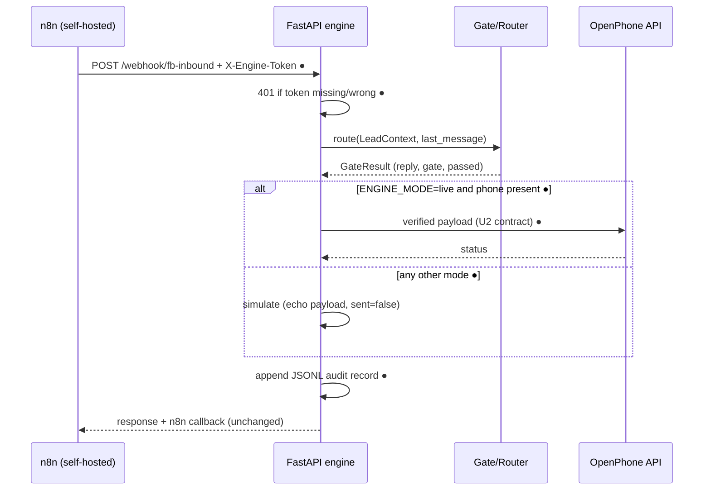
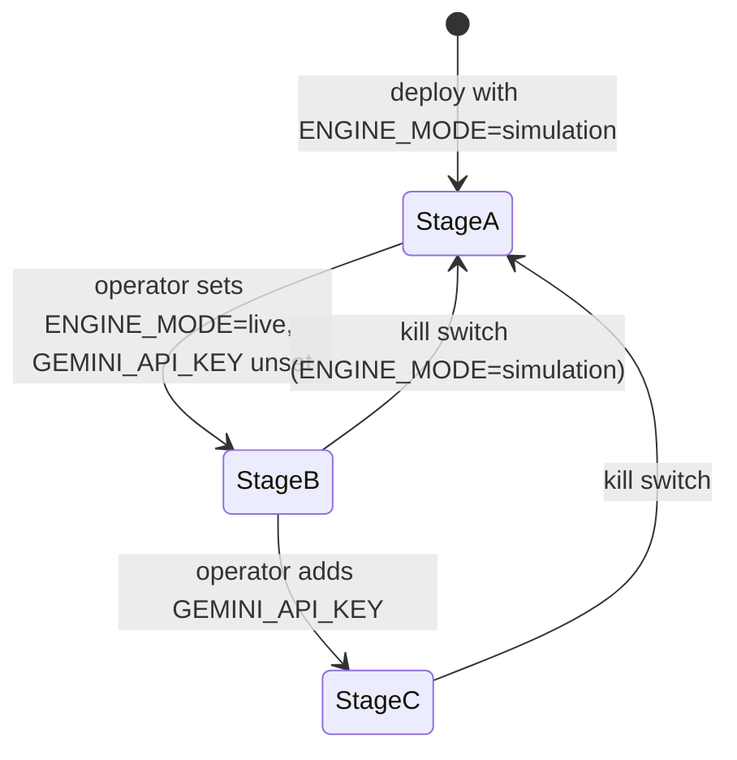

# feat: Agent-core go-live — simulation to production

## Summary

Take the built-and-tested lead qualification engine (`src/agent_core` + `src/main.py`) from idle simulation to a locally deployed service handling real FB inbound leads: explicit live/simulation gating, verified OpenPhone contract, authenticated webhook, dispatch audit logging, launchd deployment, and a staged go-live runbook. Rollback at every stage is one env flip back to simulation.

---

## Problem Frame

The engine is done (gates, router, Gemini personalization, OpenPhone/n8n outbound, 111+ tests) but has never sent a message. README's Next list names the gap: real keys, contract verification, n8n wiring, deployment, smoke test. Two defects block a safe go-live today:

1. **Implicit live mode.** `OpenPhoneDispatcher` goes live the moment `OPENPHONE_API_KEY` is set — no explicit switch, no kill switch.
2. **Unverified OpenPhone contract.** `openphone_payload()` sends `{recipient, body}` with bare-key `Authorization`; README itself flags "verify field names + auth scheme before first send." The current OpenPhone v1 Messages API is believed to use `{content, from, to[]}` — the contract is likely wrong and would 4xx on first live send.

Also missing: webhook auth (endpoint is open), persistent dispatch audit, and any deployment artifact.

---

## Requirements

**Safety gating**

- R1. Live sending requires `ENGINE_MODE=live` explicitly; any other value (including unset) forces simulation even when all API keys are present.
- R2. Flipping `ENGINE_MODE` away from `live` is the documented kill switch; no code change or redeploy needed beyond restart.
- R3. Startup validates config and logs an integration summary (OpenPhone/Gemini/n8n each: live|simulated|disabled); live mode with missing OpenPhone key fails fast at startup.

**Contract correctness**

- R4. OpenPhone request payload, endpoint, and auth header verified against current official docs before first live send; contract functions and tests updated to match.
- R5. `OPENPHONE_FROM_NUMBER` (the sending number) becomes required config in live mode if the verified contract needs it.

**Security**

- R6. `POST /webhook/fb-inbound` requires a shared-secret header (`X-Engine-Token`); requests without it get 401. `GET /healthz` stays open.
- R7. Secret lives in `.env` (gitignored); `.env.example` documents all engine variables with placeholders.

**Observability**

- R8. Every dispatch attempt (simulated or live) appends one JSONL record to a local audit log: lead_id, gate, passed, deterministic, mode, sent/simulated/error, latency_ms, timestamp. No message body PII beyond what the engine already returns.
- R9. SLA breaches (>20s) and n8n callback failures remain logged as warnings (already implemented — preserve under refactor).

**Deployment**

- R10. The engine runs as a supervised local service (launchd) bound to 127.0.0.1, loading `.env` at startup (`src/main.py` currently never calls `load_dotenv` — fix).
- R11. A smoke-test procedure exercises `/healthz` and a simulated `/webhook/fb-inbound` round-trip against the deployed service.

**Rollout & docs**

- R12. Staged go-live is documented and enforced by config: Stage A simulation (deployed, n8n wired, zero sends) → Stage B live deterministic-only (Gemini key unset) → Stage C live + personalization. Each stage gate is an operator decision.
- R13. README gains a go-live runbook with operator-owned steps explicitly marked (OpenPhone key + number, n8n workflow pointing, Gemini key, stage promotions).

---

## Key Technical Decisions

- **Explicit `ENGINE_MODE` over key-presence gating:** key-presence (current behavior) makes setting a secret a side-effectful go-live. An explicit mode variable separates "credentials exist" from "sending is authorized," and gives R2 its one-flip rollback.
- **Contract verification is an implementation unit, not a plan assumption:** the OpenPhone payload shape is unverified at plan time; U2 owns fetching current docs and reshaping `openphone_payload`/`openphone_headers`. The plan deliberately does not pin the final field names.
- **Shared-secret header, not full auth:** the service binds to 127.0.0.1 and receives only from self-hosted n8n; a static header token stops accidental/local misuse without an auth framework.
- **JSONL audit log under `logs/`:** matches the repo's flat-file, gitignored-outputs posture (`logs/` already ignored); no database.
- **launchd over reverse-proxy setups:** single-operator macOS box, localhost-only consumer (n8n). A plist with `KeepAlive` is the smallest supervised deployment; README's "reverse proxy" option is deferred.
- **Stage B ships without Gemini:** deterministic gate replies are already fair-housing-tested (`tests/test_agent_core.py` compliance checks); personalization adds LLM variance and is promoted last (R12).

---

## High-Level Technical Design

Inbound flow with the new gate (changes marked ●):

Rollout stages (operator-promoted, config-enforced):

---

## Implementation Units

### U1. Explicit mode gate + config validation + dotenv

- **Goal:** `ENGINE_MODE` controls sending; startup validates and summarizes config.
- **Requirements:** R1, R2, R3, R7, R10 (dotenv part)
- **Dependencies:** none
- **Files:** `src/main.py`, `src/agent_core/router.py` (dispatcher gains explicit `live` flag), `.env.example`, `tests/test_agent_core.py`
- **Approach:** Read `ENGINE_MODE` in lifespan; construct `OpenPhoneDispatcher` with `live=(mode=="live")` — dispatcher simulates unless both `live` and key are set. Live mode + missing key → raise at startup. Log one-line integration summary. Add `load_dotenv()` at entry. Extend `.env.example` with `ENGINE_MODE=simulation`, `OPENPHONE_API_KEY`, `OPENPHONE_FROM_NUMBER`, `N8N_WEBHOOK_URL`, `N8N_API_KEY`, `GEMINI_API_KEY`, `GEMINI_MODEL`, `ENGINE_WEBHOOK_TOKEN` placeholders.
- **Patterns to follow:** existing lifespan wiring in `src/main.py`; simulation echo behavior in `OpenPhoneDispatcher.send`.
- **Test scenarios:**
  - Key set + `ENGINE_MODE=simulation` → send returns `simulated: true`, no HTTP call (mock client asserts not called).
  - Key set + `ENGINE_MODE=live` → dispatcher posts (mocked).
  - `ENGINE_MODE` unset → simulation (default-safe).
  - Live mode, key missing → startup raises with clear message.
  - Integration summary logged with correct per-service states.
- **Verification:** running with no `.env` serves simulated responses; live requires deliberate config.

### U2. OpenPhone contract verification + fix

- **Goal:** Payload/endpoint/auth match current OpenPhone Messages API docs.
- **Requirements:** R4, R5
- **Dependencies:** U1
- **Files:** `src/agent_core/router.py`, `tests/test_agent_core.py`
- **Approach:** Fetch current OpenPhone API reference (https://www.openphone.com/docs / developer portal) at implementation time; reshape `openphone_payload` (expected: `content` + `from` + `to` list, but docs win), `openphone_headers` (verify whether auth is bare key or scheme-prefixed), and `OPENPHONE_ENDPOINT`. Thread `OPENPHONE_FROM_NUMBER` through dispatcher config; require it in live mode. Simulation echo keeps the same verified payload shape so simulated output is a faithful preview.
- **Execution note:** verify against live docs first; do not code the payload from memory.
- **Test scenarios:**
  - Payload builder emits exactly the verified field set for body-only and body+media inputs.
  - Header builder matches the verified auth scheme.
  - Live send without `OPENPHONE_FROM_NUMBER` (if required by docs) → config error, no request.
  - Existing dispatcher error-path tests (HTTP failure → `sent: false, error`) still pass with new shape.
- **Verification:** one manual Stage-B send to the operator's own phone number succeeds (runbook step, operator-owned).

### U3. Webhook auth + dispatch audit log

- **Goal:** Endpoint rejects unauthenticated calls; every dispatch is auditable.
- **Requirements:** R6, R8, R9
- **Dependencies:** U1
- **Files:** `src/main.py`, `tests/test_agent_core.py`
- **Approach:** FastAPI dependency checks `X-Engine-Token` against `ENGINE_WEBHOOK_TOKEN`; if the env var is unset, startup warns and (simulation) allows / (live) fails fast — live never runs open. Append JSONL audit record per request to `logs/engine_dispatch.jsonl` (R8 field set); write failures log a warning but never block the response path.
- **Test scenarios:**
  - Missing/wrong token → 401, no routing executed.
  - Correct token → 200 with existing response shape.
  - Live mode + unset token env → startup failure.
  - Audit record written per request with mode + outcome fields; simulated and mocked-live records differ in `mode`/`sent`.
  - Audit write failure (unwritable dir, mocked) → response still 200.
  - `/healthz` requires no token.
- **Verification:** TestClient suite green; `logs/engine_dispatch.jsonl` accumulates one line per request in a local run.

### U4. launchd deployment + smoke test

- **Goal:** Engine runs supervised on login, localhost-only, with a repeatable smoke test.
- **Requirements:** R10, R11
- **Dependencies:** U1, U3
- **Files:** `deploy/engine.launchd.plist` (new), `deploy/run_engine.sh` (new), `scripts/engine_smoke.py` (new), README.md (referenced by U5)
- **Approach:** `run_engine.sh` activates `.venv`, `exec`s uvicorn on 127.0.0.1:8000; plist with `KeepAlive`, stdout/stderr to `logs/engine.{out,err}.log`, installed to `~/Library/LaunchAgents` (operator step). `engine_smoke.py` hits `/healthz`, then posts one canned lead with the token and asserts a simulated, SLA-met response; exits non-zero on any mismatch.
- **Test scenarios:**
  - Smoke script against a locally started app (subprocess or TestClient) → exit 0 in simulation.
  - Smoke script with wrong token → exit non-zero (proves auth is on in deployment).
  - Test expectation for plist/shell: none — validated by the smoke test against the running service.
- **Verification:** `launchctl load` → smoke script passes; `launchctl unload`/reload documented and tested manually once.

### U5. Go-live runbook + README

- **Goal:** Staged rollout is documented; operator-owned steps unambiguous.
- **Requirements:** R12, R13
- **Dependencies:** U1–U4
- **Files:** `README.md`
- **Approach:** Replace the engine bullet-list in "Done / Next" with a runbook section: Stage A/B/C definitions, per-stage entry checklist, kill-switch procedure, smoke-test command, and operator-owned items marked `(manual)`: create OpenPhone API key + confirm sending number, point n8n FB-inbound workflow at the webhook with the token header, watch first 10 live leads manually before Stage C, set Gemini key. Include the audit-log location and what to check after the first live day.
- **Test scenarios:** Test expectation: none — documentation only; correctness proven by executing the runbook during rollout.
- **Verification:** a cold reader can go simulation → Stage B using only the runbook.

---

## Acceptance Criteria

1. Fresh checkout + `.env` from example → service starts in simulation; `scripts/engine_smoke.py` passes with zero outbound HTTP.
2. Setting only `OPENPHONE_API_KEY` (without `ENGINE_MODE=live`) still sends nothing — proven by test and smoke run.
3. Live mode with missing key, from-number (if required), or webhook token fails at startup, not at first lead.
4. Unauthenticated webhook POST returns 401 in all modes.
5. Every processed lead produces one audit line in `logs/engine_dispatch.jsonl`; nothing under `logs/` or `.env` is committed.
6. Full suite + ruff green; existing 111 engine/other tests unaffected.

---

## Scope Boundaries

**Deferred to follow-up work:**

- Wiring `fb_leads` approved leads into the engine (separate integration plan).
- Reverse-proxy/remote deployment, HTTPS, multi-operator auth.
- SLA dashboard/reporting beyond the JSONL log.
- Template matrix expansion toward the 333-SLP target.

**Outside this product's identity:** unsolicited outreach, bulk messaging, FB browser automation, replying to anyone who didn't message first. The engine answers inbound leads only.

---

## Risks & Dependencies

- **OpenPhone contract drift** — highest risk, owned by U2; first live send is deliberately a single operator-witnessed message.
- **FB/OpenPhone account exposure from bad auto-replies** — mitigated by staged rollout (deterministic-only Stage B uses the compliance-tested templates verbatim) and the manual watch of the first 10 leads.
- **n8n is the state owner** — the engine stays stateless; if n8n retries a lead, the engine will re-reply. Documented in runbook; dedupe belongs to n8n, revisit only if real duplicates appear.
- **No new Python dependencies**; launchd is macOS-native.

---

## Sources & Research

- `src/main.py`, `src/agent_core/router.py` — current gating, contracts, simulation behavior (defects R1/R4 identified here).
- `tests/test_agent_core.py` — TestClient + mock patterns, fair-housing template checks.
- `README.md` "Done / Next" — the go-live gap list this plan executes.
- `.env.example` — missing all engine variables (U1 fixes).
- OpenPhone API reference (fetch at U2 execution): https://www.openphone.com/docs
