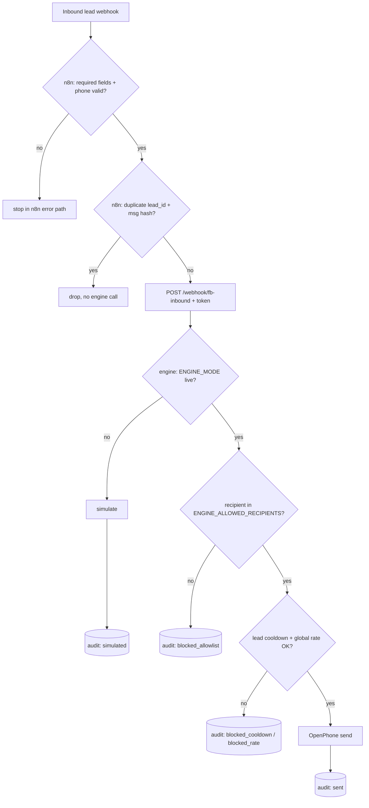

# feat: Pre-live send gates and n8n workflow v2

## Summary

Before flipping `ENGINE_MODE=live`, add layered send gates: n8n (state owner) validates, dedupes, and paces inbound leads before calling the engine; the engine (policy owner) adds a Stage B recipient allowlist and a thin rate backstop; the audit log records every gate decision. Ships with the minimum Stage B checklist and an explicit do-not-build-yet list. No gate can be bypassed by config accident — live sending remains double-gated (`ENGINE_MODE=live` AND allowlist match).

---

## Problem Frame

Stage A proved the pipe (n8n → engine → simulated dispatch, audited). The current n8n workflow is a plain forwarder and the engine will message any `phone` it receives once live — nothing dedupes retries, paces bursts, or limits who can receive the first real sends. Turning on live mode today would trust unvalidated inbound payloads with real SMS. This plan is the last hardening layer before Stage B.

**Ownership split (answers "who owns what"):**

| Concern | Owner | Rationale |
|---|---|---|
| Lead state, dedupe, retry semantics | n8n | Already the declared state owner; engine stays stateless per request |
| Intake validation (required fields, phone shape) | n8n | Reject junk before it costs an engine call |
| Pacing / queueing of bursts | n8n | Workflow-level concern; engine sees one lead at a time |
| Qualification policy (gates, templates, compliance exits) | engine | Tested deterministic core; never in n8n |
| Send authorization (mode, allowlist, rate backstop) | engine | Last line of defense must live where the send happens |
| Dispatch + audit trail | engine | Single append-only record of every attempt |

---

## Requirements

**Engine send gates**

- R1. Live sends require the recipient to match `ENGINE_ALLOWED_RECIPIENTS` (comma-separated E.164 list); non-matching recipients get a simulated-style refusal recorded as `blocked_allowlist`, never a send.
- R2. `ENGINE_ALLOWED_RECIPIENTS=*` is the explicit promotion to open sending; live mode with the variable unset or empty refuses all sends (fail-closed).
- R3. A per-lead backstop refuses a second live send to the same `lead_id` within a cooldown window (in-memory, default 60s) — defense-in-depth behind n8n's dedupe, not a replacement.
- R4. A global backstop caps live sends per minute (default 10); excess attempts are refused and audited, not queued.
- R5. Gate evaluation order is fixed: mode → allowlist → per-lead cooldown → global cap → dispatch; the first failing gate short-circuits.

**Audit**

- R6. Every audit record gains: `recipient` (last-4 masked), `send_decision` (`sent | simulated | blocked_allowlist | blocked_cooldown | blocked_rate | no_phone | not_attempted`), and `stage` (the `ENGINE_MODE` plus allowlist openness, e.g. `live-allowlist` vs `live-open`).
- R7. Existing audit fields and the write-failure-never-blocks-response behavior are preserved.

**n8n workflow v2**

- R8. Before calling the engine, the workflow validates required fields (`lead_id`, `metadata.rent`, message text) and normalizes `phone`; invalid payloads stop in n8n with an error path, never reaching the engine.
- R9. The workflow dedupes on `lead_id` + last-message hash (n8n workflow static data), dropping exact retries.
- R10. The revised workflow is re-exported sanitized to the existing `ops/n8n/` location with updated import notes.

**Rollout & docs**

- R11. README Stage B checklist becomes: verify simulation audit trail → set OpenPhone key + from-number → set `ENGINE_ALLOWED_RECIPIENTS` to operator's own number only → flip `ENGINE_MODE=live` → operator sends a test inbound and witnesses the SMS arrive on their own phone → watch first 10 real leads with allowlist widened per-lead or `*` → only then consider Stage C. Kill switch unchanged (`ENGINE_MODE=simulation`).
- R12. The do-not-build-yet list is recorded in the runbook: no Gemini/AI generation, no CRM/Airtable state store, no operator dashboard, no full lead-state machine, no multi-number sending — all gated on deterministic live sending being stable.

---

## Key Technical Decisions

- **Engine is the last gate even though n8n enforces first:** n8n workflows are hand-edited in a UI and easy to break silently; the send-side gates (R1–R5) make a broken workflow degrade to refusals, not accidental sends.
- **Allowlist over feature flag for first sends:** binds Stage B risk to *recipients* (operator's own phone) rather than a boolean, so the promotion path is gradual and auditable (`live-allowlist` → `live-open` visible in every record).
- **In-memory backstops, no persistence:** cooldown/rate state resets on restart — acceptable because n8n owns real dedupe (R9) and the backstop only has to blunt bursts and loops; a store would violate the stateless-engine boundary for marginal gain.
- **Refuse, don't queue:** excess sends are dropped with an audit record; queueing inside the engine would create hidden state and delayed surprise sends. n8n owns pacing (R8) if queueing is ever wanted.
- **Dedupe hash in n8n static data, not an external store:** matches do-not-build-yet (no CRM yet); workflow static data survives n8n restarts and is enough for exact-retry suppression.

---

## High-Level Technical Design

Gate chain — first failure short-circuits, everything lands in the audit log:

---

## Implementation Units

### U1. Engine allowlist + rate backstops

- **Goal:** Live sends pass R1–R5 gates or are refused and audited.
- **Requirements:** R1, R2, R3, R4, R5
- **Dependencies:** none
- **Files:** `src/agent_core/guardrails.py` (new), `src/main.py`, `src/agent_core/router.py` (dispatcher takes a pre-authorized decision), `.env.example`, `tests/test_agent_core_guardrails.py` (new)
- **Approach:** New `SendAuthorizer` evaluating the fixed gate order against config (`ENGINE_ALLOWED_RECIPIENTS`, `ENGINE_LEAD_COOLDOWN_S`, `ENGINE_MAX_SENDS_PER_MIN`) and in-memory state (lead→last-send timestamp dict, sliding-window send counter). `fb_inbound` consults it before `dispatcher.send`; refusals skip dispatch entirely. Live startup validation extends the existing `missing` check: live + empty allowlist logs a fail-closed warning (allowed to start — it just refuses sends, which is the Stage B pre-key posture).
- **Patterns to follow:** deterministic no-I/O gate style of `src/agent_core/agents.py`; config plumbing added in the go-live PR (`src/main.py` lifespan).
- **Test scenarios:**
  - Simulation mode → authorizer never blocks, everything simulates (Stage A behavior unchanged).
  - Live + allowlist containing recipient → authorized.
  - Live + recipient not in list → `blocked_allowlist`, dispatcher not called.
  - Live + empty/unset allowlist → all sends refused (fail-closed, R2).
  - `*` → any recipient authorized.
  - Two sends same `lead_id` inside cooldown → second is `blocked_cooldown`; after window (injected clock) → authorized.
  - 11th send in a minute at default cap → `blocked_rate`.
  - Gate order: non-allowlisted recipient during rate exhaustion reports `blocked_allowlist` (first gate wins, R5).
- **Verification:** guardrail tests green; simulation smoke run byte-identical to pre-change behavior.

### U2. Audit enrichment

- **Goal:** Every gate decision is visible in `logs/engine_dispatch.jsonl`.
- **Requirements:** R6, R7
- **Dependencies:** U1
- **Files:** `src/main.py` (`audit_record`), `tests/test_agent_core.py` (extend)
- **Approach:** Extend `audit_record` with `recipient` (mask all but last 4), `send_decision` from the authorizer/dispatch outcome, `stage` derived from mode+allowlist openness. Field additions only — existing keys unchanged (R7).
- **Test scenarios:**
  - Simulated request → `send_decision: simulated`, masked recipient like `***1234`.
  - Blocked-allowlist request → `blocked_allowlist`, `stage: live-allowlist`.
  - Lead without phone → `no_phone`.
  - Audit write failure still returns 200 (existing test preserved).
- **Verification:** one JSONL line per request with the new fields; old fields intact.

### U3. n8n workflow v2 + re-export

- **Goal:** n8n validates, normalizes, and dedupes before the engine call.
- **Requirements:** R8, R9, R10
- **Dependencies:** U1 (so end-to-end testing sees final engine behavior)
- **Files:** `ops/n8n/agent-core-stage-a-inbound.workflow.json` (superseded by v2 export, keep filename or version it per `ops/n8n/README.md` convention), `ops/n8n/README.md`, `scripts/engine_smoke.py` (extend with an n8n-path check)
- **Approach:** Edit in n8n UI: add a validation node (required fields, E.164 normalization for `phone`), a dedupe node using workflow static data keyed `lead_id:sha(last message)`, and an error path that stops invalid payloads with a workflow-visible failure. Re-export sanitized (strip credentials/instance IDs — follow the existing sanitization notes in `ops/n8n/README.md`). Smoke script gains an optional `--via-n8n` mode posting to the n8n webhook and asserting an audit line appears.
- **Execution note:** workflow editing is operator/Hermes-in-UI work; the repo artifacts (export + README + smoke extension) are the code deliverables.
- **Test scenarios:**
  - Smoke `--via-n8n` with valid canned lead → engine audit line appears, `send_decision: simulated`.
  - Same payload posted twice → exactly one engine audit line (n8n dedupe drops the retry).
  - Payload missing `rent` → no engine audit line; n8n execution shows error path.
  - Direct-to-engine smoke (existing mode) unaffected.
- **Verification:** fresh n8n import of the v2 export reproduces all four outcomes.

### U4. Stage B runbook + do-not-build-yet

- **Goal:** Operator can execute Stage B from the doc alone; deferrals are on record.
- **Requirements:** R11, R12
- **Dependencies:** U1–U3
- **Files:** `README.md`
- **Approach:** Rewrite the Stage B section as the R11 checklist (each step marked operator-owned or automated, allowlist promotion path explicit: own number → named leads → `*`). Add the R12 do-not-build-yet list with the unblocking condition for each item ("after N clean live days" style, operator's call).
- **Test scenarios:** Test expectation: none — documentation only; proven by executing the checklist at Stage B.
- **Verification:** cold read suffices to run Stage B without consulting chat history.

---

## Acceptance Criteria

1. With `ENGINE_MODE=live` and no allowlist, zero sends occur under any input — proven by test and audit records.
2. Allowlist set to one number: that recipient gets the (mocked) live send; every other recipient is `blocked_allowlist`.
3. Duplicate inbound payload through n8n produces exactly one engine call.
4. Every request yields one audit line carrying `send_decision`, masked `recipient`, and `stage`.
5. Stage A simulation behavior is unchanged (existing suite green, smoke identical).
6. Full suite + ruff clean.

---

## Scope Boundaries

**Deferred to follow-up work (next slice after Stage B, in order):**

- Lead-state workflow in n8n (stage tracking across the 3-message funnel) — design from real Stage B traffic, not guesses.
- Stage C: Gemini personalization re-enabled behind the existing config gate.
- Daily audit-log digest / operator reporting.
- Wiring `fb_leads` approved leads into this pipeline.

**Do not build yet (R12, restated as identity for this slice):** CRM/Airtable/Sheets state store, operator dashboard, multi-number or multi-channel sending, AI-generated copy, any outbound to someone who didn't message first.

---

## Risks & Dependencies

- **n8n workflow edits are unversioned until re-exported** — the v2 export (R10) is the mitigation; treat unexported UI changes as uncommitted work.
- **In-memory backstop resets on engine restart** — accepted; n8n dedupe is the durable layer, and restart-window double-sends are bounded by the allowlist during Stage B.
- **Masked recipients reduce audit forensics** — accepted trade for keeping full numbers out of long-lived local logs; n8n executions retain the full payload short-term.
- **No new dependencies.**

---

## Sources & Research

- `src/main.py` (`audit_record`, config validation), `src/agent_core/router.py` — gate/dispatch seams this plan extends.
- `ops/n8n/README.md` + `ops/n8n/agent-core-stage-a-inbound.workflow.json` — existing export/sanitization convention (U3 follows it).
- `deploy/n8n.launchd.plist`, `scripts/engine_smoke.py` — supervision and smoke patterns already in place; this plan extends, not re-creates.
- `docs/plans/2026-07-04-001-feat-agent-core-go-live-plan.md` — parent staged-rollout design; this plan is its pre-Stage-B hardening layer.
